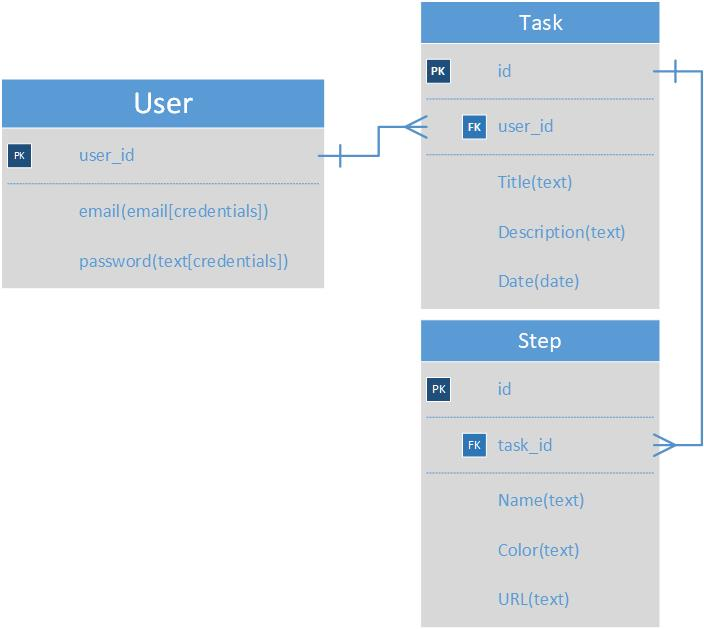

Short links:

Front-end Github Repo: https://github.com/selcuktoklucu/my-job-list-front-end
Back-End Github Repo: https://github.com/selcuktoklucu/my-job-list-back-end (Currently viewing :)

Live URL: https://selcuktoklucu.github.io/my-job-list-front-end/
Back-end URL: https://mylistss.herokuapp.com/

This repository contains a Ruby on Rails Web Application Framework, which provides user authentication, two different one-to-many relationship resources with all Create, Read,Update and Delete(CRUD) features

This system provides:
-User security
-Resource Protection
-Data Protection and Records

Unsolved Problems: Based on the scope, all requests has been answered as back-end database.

In the development process, most stuff has been done via Rails commands, which is provided by ActiveRecord feature of the Rails Framework. I planned resources well, over all project, except one vulnerability. However, I've fixed with some help. After a well designed backend, there is no changes needed in the development phase of front-end.

Tech Keywords: Single-Page-Application(SPA), Ruby on Rails, PostgreSQL, API, JSON, Git/Github, Authentication, Full-Stack, Database, RDMS

